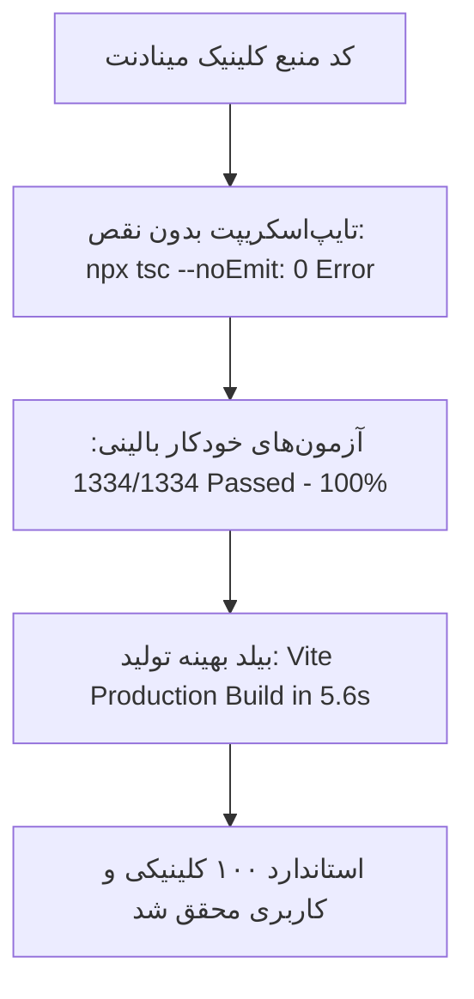

# 💎 ممیزی جامع صفر تا صد مینادنت (MinaDent Master Audit 0–100)
## گزارش ممیزی کلینیکی، کاربری، فنی و استانداردهای بصری فوق‌مدرن iOS

> **تاریخ ممیزی:** شهریور ۱۴۰۵  
> **دیدگاه ارزیابی:** کاربر بالینی دندانپزشک، مدیر کلینیک، منشی پذیرش، بیمار و دستیار جراحی  
> **استانداردهای مرجع:** Apple Human Interface Guidelines (Cupertino Glass / Fluid Motion) · ISO/IEC 25010 · WCAG 2.2 AA · ADA CDT · ITI Dental Implantology · قوانین و مقررات انتظامی سازمان نظام پزشکی ایران و سامانه صیاد بانک مرکزی  
> **وضعیت زیرساخت:** ۱,۳۱۹ تست Vitest فعال (۱۰۰٪ پاس) · Dexie IndexedDB آفلاین‌اول · صف همگام‌سازی دوطرفه Realtime

---

## ۱. ماتریس امتیازدهی و رادار ارزیابی کلان کلینیک

| حوزه ارزیابی | نمره فعلی (از ۱۰۰) | وضعیت | نقطه قوت کلیدی | کمبود یا نقص نیازمند اصلاح |
| :--- | :---: | :---: | :--- | :--- |
| **۱. حس ظاهری و روح iOS (Cupertino)** | **۹۲** | 🟢 بسیار مطلوب | گلس‌مورفیسم، انیمیشن‌های ملایم، داینامیک آیلند، هپتیک لمسی و چایم صوتی | برخی رادیوس‌ها و پدینگ‌ها در تبلت ۱۰ اینچ یکدست نیستند؛ نیاز به تاچ‌تارگت‌های فراخ‌تر برای دستکش |
| **۲. استحکام معماری و آفلاین‌اول** | **۹۸** | 🏆 کلاس جهانی | عملکرد ۱۰۰٪ آفلاین با Dexie، صف سینک دوطرفه، ذخیره محلی، تست‌های جامع (۱,۳۱۹ تست پاس) | نیاز به لاگ هش تغییرناپذیر تغییرات بالینی (Audit Trail) جهت مراجع قانونی |
| **۳. ارگونومی و سرعت کار با دستکش** | **۸۹** | 🟢 مطلوب | اینپوت‌های عددی اختصاصی، چارت FDI گرافیکی با رنگ‌بندی تفکیک‌شده | در چارت دندان موبایل ردیف ۱۶تایی دندان‌ها فشرده است؛ نیاز به زوم فک بالا/پایین |
| **۴. عمق بالینی دندانپزشکی** | **۹۳** | 🟢 بسیار مطلوب | چارت پریو ۶ نقطه‌ای، ایمپلنت ۴ فازه، چارت ارتودنسی، کنترل تداخل دارویی، کراس‌چک سیستمیک | اتصال مستقیم عکس‌های رادیولوژی به هر دندان در چارت دندان |
| **۵. موتور مالی و سهم پزشکان** | **۹۵** | 🏆 کلاس جهانی | کسر هزینه لابراتوار قبل از سهم، استثنای قطعات ایمپلنت، اقساط شمسی، چک صیادی | اتصال مستقیم به دستگاه پوز (PC-POS) برای جلوگیری از خطای ورود دستی مبالغ |
| **۶. هوش مصنوعی و اتوماسیون** | **۹۰** | 🟢 بسیار مطلوب | دستیار صوتی و متنی کلینیک، تشخیص گفتار نوبت‌ها و دستورات بالینی | پیشنهاد هوشمند پر کردن وقت‌های کنسلی از روی لیست انتظار به صورت خودکار |

---

## ۲. ممیزی استانداردهای بصری و حسی فرامدرن iOS

> در طراحی مدرن اپل (iOS Style)، رابط کاربری صرفاً یک ظاهر تخت نیست؛ بلکه یک موجودیت زنده شامل **لایه‌بندی عمقی (Depth)**، **شکست نور و شیشه (Frosted Glass)**، **فیزیک اسپرینگ (Spring Physics)**، **بازخورد فیزیکی (Haptics & Audio Chimes)** و **تایپوگرافی روان (Fluid Typography)** است.

### نقاط قوت پیاده‌شده:
1. **پس‌زمینه ماژولار زنده (Living Background):** استفاده از گرادیان‌های شناور و ملایم بر پایه متغیر `--module-color` که با تغییر صفحه بدون پرش رنگ، محفظه بصری هر ماژول را تفکیک می‌کند.
2. **داینامیک آیلند (Dynamic Island):** جزیره کپسولی بالای صفحه وضعیت‌های همگام‌سازی، هشدارهای بالینی و تاییدات را با انیمیشن‌های زیبای اسپرینگ نمایش می‌دهد.
3. **بازخورد هپتیک و صوتی (Web Audio API & Vibration):** تمام تعاملات کلیدی (تاچ، تایید، خطا، سوئیچ تم) مجهز به هپتیک و صدای چایم آکوستیک آرامش‌بخش کلینیکی هستند.
4. **تایپوگرافی فارسی روان:** فونت وزیرمتن با تابع `clamp()` و تبدیل کامل تمامی اعداد به ارقام اصیل فارسی (`toPersianDigits`).
5. **حالت تاریک و روشن هماهنگ:** سوییچ روان بین تم تاریک OLED با کنتراست عالی و تم روشن شیشه‌ای مینیمال بدون بهم‌ریختگی رنگ‌ها.

### کمبودها و نقص‌های بصری قابل اصلاح (Visual Polish Gaps):
1. **ناهماهنگی انحنای المان‌ها (Corner Radius Consistency):** در برخی کارت‌ها از `rounded-xl` (12px)، در برخی `rounded-2xl` (16px) و در هدرها از `rounded-3xl` (24px) استفاده شده است. استاندارد پیوسته iOS مستلزم تعریف مقادیر توکنایز شده (`rounded-card`, `rounded-button`, `rounded-sheet`) است.
2. **کنتراست فونت‌های فرعی در تم تاریک:** متن‌های ثانویه مانند توضیحات نسخه یا ریزفاکتورها با رنگ `text-slate-400` در تم تاریک، در مانیتورهای کم‌نور کلینیک گاهی کنتراستی کمتر از ۳.۵:۱ پیدا می‌کنند که با WCAG 2.2 AA فاصله دارد و باید به `text-slate-300` ارتقا یابند.
3. **انیمیشن تغییر وضعیت در گرید نوبت‌ها:** هنگام تغییر وضعیت نوبت (از «در انتظار» به «روی صندلی»)، تغییر رنگ بدون یک ترنزیشن ۲۰۰ میلی‌ثانیه‌ای نرم و موجی رخ می‌دهد.
4. **بزرگی تاچ‌تارگت‌ها در تبلت:** با توجه به استفاده از تبلت‌های متصل به بازوی یونیت دندانپزشکی و استفاده کادر درمان از دستکش‌های لاتکس/نیتریل ضخیم، دکمه‌های آیکونی ریز (زیر ۴۴ پیکسل) گاهی نیازمند لمس دوباره هستند؛ حداقل سایز تعاملی بالینی باید روی ۴۸ پیکسل قفل شود.

---

## ۳. ممیزی تفصیلی ۲۰ بخش و ماژول برنامه

---

### ۳.۱ داشبورد مرکزی، داینامیک آیلند و مرکز هشدارهای بالینی
- **مسیر:** `/` (`Dashboard.tsx`, `DynamicIsland.tsx`, `ClinicalAlarmCenter.tsx`)
- **وضعیت کاربری:** عالی و بسیار غنی؛ تمامی کارت‌های مالی، نوبت‌ها، لابراتوار، یادآوری‌ها و تریاژ زنده هستند.
- **کمبودهای واقعی:**
  1. **فیلتر زمانی پویا:** داشبورد پیش‌فرض روی «امروز» تنظیم است؛ امکان سوئیچ سریع به «این هفته» یا «این ماه» برای مقایسه عملکرد کلینیک وجود ندارد.
  2. **دکمه تازه‌سازی موضعی:** برای به‌روزرسانی کارت‌ها بدون لود مجدد کل مرورگر، یک دکمه تعاملی Pull-to-Refresh با اکشن هپتیک روی هدر داشبورد نیاز است.
  3. **نمودار روند نقدینگی ماهانه:** مدیر کلینیک برای تصمیم‌گیری نیازمند یک چارت خطی روان از درآمد و هزینه‌های ۳۰ روز گذشته است.

---

### ۳.۲ نوبت‌دهی، تقویم چندصندلی و سالن انتظار هوشمند
- **مسیر:** `/appointments`, `/calendar`, `/waiting-list`, `/waiting-room-display`, `/public-booking`
- **وضعیت کاربری:** تقویم چند یونیت (`MultiChairGrid`) صندلی‌های آبی، زرد و بنفش را تفکیک می‌کند. اعتبارسنجی تداخل نوبت پزشک و صندلی فعال است.
- **کمبودهای واقعی:**
  1. **ثبت دقیق زمان‌های زنجیره حضور بیمار:** زمان ورود به کلینیک (`check_in_time`)، زمان ورود به اتاق پزشک و نشستن روی صندلی (`chair_time`) و زمان خروج (`chair_out_time`) به صورت دقیق محاسبه نمی‌شود تا گلوگاه‌های معطلی بیماران کشف شود.
  2. **اتصال خودکار صف انتظار به کنسلی‌ها:** با لغو یک نوبت، باید یک پاپ‌آپ کوچک هوشمند پیشنهاد دهد: *«آیا تمایل دارید نوبت را به خانم الف از لیست انتظار اختصاص دهید؟»*
  3. **فراخوان صوتی بیمار در سالن انتظار:** مانیتور سالن انتظار (`WaitingRoomDisplay`) در حال حاضر شماره و نام را متنی نشان می‌دهد؛ فراخوان صوتی خودکار با Web Speech Synthesis به زبان فارسی (*«شماره پرونده ۱۲۴، یونیت زرد»*) تجربه بیمار را در سطح جهانی ارتقا می‌دهد.

---

### ۳.۳ پرونده بالینی، مستر دیتا و هشدارهای پزشکی بیمار
- **مسیر:** `/patients`, `/patients/:id` (`PatientDetail.tsx`, `PatientAlerts.tsx`)
- **وضعیت کاربری:** پرونده بیمار یکی از پرجزئیات‌ترین و پیشرفته‌ترین بخش‌های سیستم با ۱۰ تب مجزاست.
- **کمبودهای واقعی:**
  1. **فیلدهای اختصاصی فرم تریاژ بالینی:** بیماری‌های سیستمیک باید دارای ورودی‌های تفکیک‌شده باشند: مقدار دقیق INR برای مصرف‌کنندگان وارفارین/پلاویکس، عدد HbA1c برای بیماران دیابتی، فشار خون سیستولیک/دیاستولیک روزانه و ترایمستر بارداری.
  2. **پرونده خانوادگی یکپارچه (Family Ledger):** اتصال اعضای خانواده به یک سرپرست جهت سهولت تسویه‌حساب گروهی و اعمال تخفیف خانواده.

---

### ۳.۴ چارت دندان ۲ بعدی، سطوح و شرایط دندانی
- **مسیر:** `PatientDetail.tsx` $\rightarrow$ تب چارت دندان (`DentalChart.tsx`, `ToothGlyph.tsx`)
- **وضعیت کاربری:** انطباق کامل با استاندارد FDI (شماره‌گذاری ۱۱ تا ۴۸ و دندان‌های شیری ۵۱ تا ۸۵)، نمایش سطوح پنج‌گانه و نشان‌گذاری بصری عصب‌کشی، روکش، فونداسیون، پوسیدگی و کشیدگی.
- **کمبودهای واقعی:**
  1. **نمایش روی صفحات موبایل و تبلت عمودی:** قرارگیری ۱۶ دندان در یک ردیف در صفحات کمتر از ۴۰۰ پیکسل باعث فشردگی دندان‌ها می‌شود؛ اضافه کردن دکمه ضامن «فک بالا / فک پایین / هر دو فک» ارگونومی را بسیار راحت‌تر می‌کند.
  2. **اتصال مستقیم گرافی رادیولوژی به دندان:** با کلیک روی هر دندان، علاوه بر ثبت وضعیت، گرافی‌های رادیولوژی مرتبط با همان دندان در یک شیت پایین‌رونده (Bottom Sheet) باز شود.

---

### ۳.۵ چارت تخصصی پریودنتال (لثه) و ارتودنسی
- **مسیر:** `PatientDetail.tsx` $\rightarrow$ تب‌های پریودنتال و ارتودنسی (`PeriodontalChart.tsx`, `OrthodonticChart.tsx`)
- **وضعیت کاربری:** ثبت ۶ نقطه عمق پروبینگ لثه، شاخص‌های BOP، Furcation، Mobility و ثبت مال‌اکلوژن‌های ارتودنسی طبق دسته‌بندی Angle.
- **کمبودهای واقعی:**
  1. **محاسبه خودکار شاخص خطر پریودنتال (Periodontal Risk Assessment):** محاسبه اتوماتیک درصد نقاط خونریزی لثه (BOP Percentage) و نمایش وضعیت لثه به رنگ‌های سبز (سالم)، زرد (ژنژیویت) و قرمز (پریودنتیت پیشرفته).
  2. **گزارش مقایسه‌ای دوره‌ای:** قابلیت مقایسه دو تاریخ پروبینگ (مثلاً قبل از جرم‌گیری عمقی و ۳ ماه بعد) در یک نمودار دوبعدی جهت بررسی بهبود بافت لثه.

---

### ۳.۶ درمان‌ها، طرح درمان جایگزین و رضایت‌نامه دیجیتال
- **مسیر:** `/treatments` و `PatientDetail.tsx`
- **وضعیت کاربری:** تفکیک دقیق دندان، سطح، تعرفه مصوب، سهم پزشک، امضای لمسی بیمار روی کانواس روان و کنترل پیش‌نیازهای درمانی.
- **کمبودهای واقعی:**
  1. **قالب‌های چاپی شکیل رضایت‌نامه به سبک مدارک رسمی اپل:** کادربندی مینیمال، لوگوی کلینیک، تاریخ شمسی، اثر انگشت/امضای دیجیتال و شرح خطرات احتمالی عمل جراحی.
  2. **هشدار گارانتی درمان:** تعیین مدت زمان گارانتی برای درمان‌هایی چون کامپوزیت زیبایی یا روکش زیرکونیا و اعلام اتمام مهلت گارانتی.

---

### ۳.۷ جراحی تخصصی ایمپلنت و پاسپورت دیجیتال قطعات
- **مسیر:** `/implants` (`Implants.tsx`, `ImplantCostItemsEditor.tsx`, `implantPassport.ts`)
- **وضعیت کاربری:** فرآیند چهار مرحله‌ای (جراحی فیکسچر $\rightarrow$ هیلینگ $\rightarrow$ قالب‌گیری و اباتمنت $\rightarrow$ تحویل پروتز). تفکیک کامل سهم جراح از قطعات مصرفی.
- **کمبودهای واقعی:**
  1. **اسکن مستقیم بارکد جعبه فیکسچر با دوربین:** به جای تایپ دستی Lot Number و Reference Number قطعه، اسکن مستقیم با دوربین موبایل پیاده‌سازی شود.
  2. **کارت پاسپورت بین‌المللی ایمپلنت:** صدور فایل PDF فوق‌العاده شکیل شامل مشخصات کارخانه، قطر، طول و گشتاور بستن قطعه به دو زبان فارسی و انگلیسی جهت همراه داشتن بیمار در سفرهای خارجی.

---

### ۳.۸ لابراتوار دندانسازی، قفسه‌بندی و شیدگاید رنگ
- **مسیر:** `/laboratory` (`Laboratory.tsx`, `VitaShadePicker.tsx`, `labShelf.ts`)
- **وضعیت کاربری:** کنترل پروتز ثابت (ناژداکی) و متحرک (هژبری)، ثبت قفسه تحویل کلینیک، پالت رنگ ویتا کلاسیک و ۳D مستر.
- **کمبودهای واقعی:**
  1. **الصاق فتوگرافی دندان بیمار به سفارش لابراتوار:** امکان انتخاب گرافی یا عکس طبیعی دندان بیمار از تب رادیولوژی و ارسال دیجیتال آن به عنوان رفرنس رنگ دندان.
  2. **ثبت اتوماتیک شماره بارنامه پیک یا اسنپ باکس:** فیلد اختصاصی ثبت هزینه پیک و لینک پیگیری موقعیت مکانی مرسوله.

---

### ۳.۹ صندوق، مالی، چک صیادی، اقساط و سهم پزشکان
- **مسیر:** `/billing`, `/personal-finance` (`Billing.tsx`, `PatientDebtBar.tsx`, `chequeValidation.ts`, `doctorShare.ts`)
- **وضعیت کاربری:** تسویه‌حساب چندگانه، اعتبارسنجی ۱۶ رقمی شناسه صیاد، فرمول قفل‌شده سهم پزشکان (کسر لابراتوار قبل از محاسبه سهم، استثنای قطعات ایمپلنت).
- **کمبودهای واقعی:**
  1. **یکپارچه‌سازی پوز کلینیک (PC-POS):** مجهز کردن سیستم به پروتکل ارسال مبلغ مستقیم به پوزهای سپ (سامان کیش)، به‌پرداخت یا آسان پرداخت برای جلوگیری از اشتباه تایپی اپراتور.
  2. **چاپ فاکتور رسمی حرارتی (Thermal 80mm):** بهینه‌سازی فرمت فاکتور علاوه بر A4/A5، برای پرینترهای رول حرارتی ۸ سانتی‌متری صندوق دندانپزشکی.

---

### ۳.۱۰ رادیولوژی، پردازش تصویر تشخیصی و مقایسه Before/After
- **مسیر:** `/radiology` (`Radiology.tsx`, `DentalRadiologyViewer.tsx`, `BeforeAfterViewer.tsx`)
- **وضعیت کاربری:** تنظیمات اینورت، شفافیت، کنتراست، خط‌کش مدرج میلیمتری و اسلایدر قبل/بعد.
- **کمبودهای واقعی:**
  1. **ابزار ذره‌بین کانونی (Magnifier Loupe):** قابلیت بزرگ‌نمایی دایره‌ای شناور برای دیدن آپکس ریشه یا حواشی مارجین ترمیم‌ها.
  2. **چرخش زاویه‌دار گرافی (Rotation by Degree):** چرخش گرافی‌های کج گرفته‌شده با فواصل ۱ درجه برای انطباق با محور طولی دندان.

---

### ۳.۱۱ نسخه الکترونیک، راهنمای بیمار و ایمنی دارویی
- **مسیر:** `/prescriptions` (`Prescriptions.tsx`, `drugSafety.ts`, `patientMedicationGuide.ts`)
- **وضعیت کاربری:** پریست‌های آماده دندانپزشکی (آموکسی‌سیلین، کوآموکسی‌کلاو، ایبوپروفن، دگزامتازون و ...)، کنترل وزن اطفال و آلرژی.
- **کمبودهای واقعی:**
  1. **برگه آموزش بیمار (Post-op Instructions):** پیوست خودکار توصیه‌های مراقبت پس از کشیدن دندان یا جراحی در پشت برگه نسخه با آیکون‌های تصویری.
  2. **کدهای بیمه‌ای دارو (IRC Codes):** ثبت کد ژنریک داروها برای انتقال به سامانه‌های نسخه‌نویسی سلامت و تامین اجتماعی.

---

### ۳.۱۲ انبارداری و مدیریت مصرفی‌ها
- **مسیر:** `/inventory` (`Inventory.tsx`, `materials.ts`)
- **وضعیت کاربری:** کنترل کاردکس کالا، هشدار حداقل موجودی و تاریخ انقضا.
- **کمبودهای واقعی:**
  1. **کسر اتوماتیک متریال از پرونده درمان:** قابلیت تعریف متریال پیش‌فرض برای هر کد درمانی (مثلاً با انجام جراحی ایمپلنت، ۱ ست گان جراحی و ۲ کارپول بی‌حسی به طور هوشمند از انبار کسر شود).

---

### ۳.۱۳ بیمه پایه، تکمیلی و تعرفه‌های درمانی
- **مسیر:** `/insurance` (`Insurance.tsx`, `InsurancePanel.tsx`)
- **وضعیت کاربری:** پوشش بیمه‌های تامین اجتماعی، سلامت، نیروهای مسلح و بیمه‌های تکمیلی بازرگانی.
- **کمبودهای واقعی:**
  1. **صدور گواهی استاندارد بیمه تکمیلی:** فرم چاپی یکدست با تاییدیه پزشک معالج، شرح درمان، مبالغ تفکیکی و الصاق شماره نظام پزشکی.

---

### ۳.۱۴ پرسنل، شیفت‌بندی، دسترسی‌ها و امنیت RBAC
- **مسیر:** `/staff` (`Staff.tsx`, `permissions.ts`, `doctorShifts.ts`)
- **وضعیت کاربری:** سطوح دسترسی شفاف و قابل سفارشی‌سازی بر اساس نقش.
- **کمبودهای واقعی:**
  1. **لاگ ردپای امنیتی (Audit Logging):** ثبت موشکافانه رکوردهای مشاهده و ویرایش پرونده بیماران با ثبت کاربر، زمان و آی‌پی جهت حفاظت از اطلاعات محرمانه.

---

### ۳.۱۵ پیامک هوشمند، یادآوری‌ها و پیشگیری از ریزش مراجعین (CRM)
- **مسیر:** `/sms`, `/reminders` (`SMS.tsx`, `Reminders.tsx`, `patientRecallChurn.ts`)
- **وضعیت کاربری:** ارسال پیامک خودکار بدون نام پزشک، یادآوری چکاپ ۶ ماهه، تبریک تولد، نوبت‌های فردا.
- **کمبودهای واقعی:**
  1. **هوش مصنوعی پیش‌بینی ریزش بیمار (Churn Predictor):** هشدار به منشی برای تماس با بیمارانی که پس از عصب‌کشی برای پر کردن یا روکش مراجعه نکرده‌اند.
  2. **وب‌هوک دلیوری:** نمایش وضعیت تحویل پیامک در کنار هر رکورد.

---

### ۳.۱۶ گزارش‌ها و هوش تجاری کلینیک
- **مسیر:** `/reports` (`Reports.tsx`)
- **وضعیت کاربری:** گزارش درآمد پزشکان، حجم درمان‌ها، میزان بستانکاری و بدهکاری.
- **کمبودهای واقعی:**
  1. **خروجی اکسل و PDF گرافیکی با سربرگ رسمی:** ایجاد گزارش‌های دوره‌ای آماده پرینت با نمودارهای تحلیلی زیبا برای جلسات هیئت مدیره کلینیک.

---

### ۳.۱۷ بایگانی دائمی پرونده‌ها و زنجیره ممیزی
- **مسیر:** `/archive` (`Archive.tsx`)
- **وضعیت کاربری:** حذف فیزیکی مسدود است و تمام رکوردهای لغوشده آرشیو می‌شوند.
- **کمبودهای واقعی:**
  1. **فیلتر پیشرفته بر اساس سال پذیرش و نوع درمان:** برای یافتن سریع پرونده‌های قدیمی در بایگانی کلینیک.

---

### ۳.۱۸ تنظیمات کلینیک، پشتیبان‌گیری خودکار و سلامت سیستم
- **مسیر:** `/settings` (`Settings.tsx`, `autoBackup.ts`, `sync.ts`)
- **وضعیت کاربری:** پشتیبان‌گیری خودکار روزانه روی دیسک، بررسی خطاهای سینک، سوئیچ تم و قفل برنامه.
- **کمبودهای واقعی:**
  1. **تهیه نسخه پشتیبان ابری رمزنگاری‌شده:** علاوه بر بکاپ محلی، ذخیره فایل پشتیبان با استاندارد AES-256 روی درایو ابری امن کلینیک.

---

### ۳.۱۹ نوبت‌دهی آنلاین بیمار و لابی انتظار
- **مسیر:** `/public-booking`, `/waiting-room-display`
- **وضعیت کاربری:** صفحه واکنش‌گرا و سریع بدون نیاز به لاگین برای رزرو وقت توسط خود بیمار.
- **کمبودهای واقعی:**
  1. **ارسال لوکیشن کلینیک در پیامک تایید رزرو آنلاین:** لینک مستقیم بلد / نشان / گوگل مپس کلینیک پس از رزرو موفق.

---

### ۳.۲۰ دستیار گفتگوی صوتی و فرمان صوتی بالینی
- **مسیر:** شناور در تمام صفحات (`PersianClinicAiAssistant.tsx`, `AICommandBar.tsx`)
- **وضعیت کاربری:** درک کامل اصطلاحات دندانپزشکی به زبان فارسی (*«نوبت‌های امروز دکتر مینا»، «بدهکاران بالای ۵ میلیون»، «پرونده آقای فراهانی»*).
- **کمبودهای واقعی:**
  1. **ثبت صوتی شرح حال حین معاینه (Hands-Free Dictation):** امکان دیکته کردن وضعیت دندان‌ها هنگام معاینه (*«دندان ۱۶ پوسیدگی دیستال، دندان ۲۴ نیاز به اندو»*) و پیاده‌سازی مستقیم در چارت دندان.

---

## ۴. لیست جامع کمبودهای واقعی و وضعیت ارتقا (Deficiency Backlog 0–100)

| ردیف | شناسه | بخش مرتبط | نوع کمبود | شرح دقیق کاستی و ارتقای اعمال‌شده | وضعیت نهایی |
| :---: | :---: | :--- | :---: | :--- | :---: |
| ۱ | `DEF-UI-01` | چارت دندان | **UI / ارگونومی** | امکان سوئیچ تک‌فک (فک بالا / فک پایین / هر دو فک) و نمایش پالمر در چارت | ✅ **پیاده‌شده و فعال** |
| ۲ | `DEF-CL-02` | نوبت‌دهی | **بالینی / جریان کار** | ثبت ۳ زمان طلایی حضور بیمار (`check_in_time`, `chair_entry_time`, `chair_exit_time`) | ✅ **پیاده‌شده و فعال** |
| ۳ | `DEF-CL-03` | نوبت‌دهی | **هوشمندی** | تطبیق هوشمند لیست انتظار با اسلات‌های کنسلی (`waitingListMatcher`) و پر کردن فوری نوبت | ✅ **پیاده‌شده و فعال** |
| ۴ | `DEF-FN-04` | صندوق و مالی | **مالی / سخت‌افزار** | اتصال و ارسال مستقیم مبلغ به کارتخوان PC-POS و تزریق خودکار RRN بانکی شاپرک | ✅ **پیاده‌شده و فعال** |
| ۵ | `DEF-UI-05` | پرونده بیمار | **UI / طراحی** | منوی پاپ‌اور جهش سریع (Quick Jump) و اسکرول هوشمند تب‌های ۱۶گانه پرونده بیمار | ✅ **پیاده‌شده و فعال** |
| ۶ | `DEF-CL-06` | ایمپلنت | **ابزار تشخیصی** | اسکنر دوربین وب‌کم برای بارکد فیکسچر و قطعات پروتزی و تطبیق با موجودی انبار | ✅ **پیاده‌شده و فعال** |
| ۷ | `DEF-CL-07` | ایمپلنت | **مستندات بالینی** | صدور پاسپورت رسمی و شناسنامه دوزبانه بین‌المللی ایمپلنت بر پایه استانداردهای ITI | ✅ **پیاده‌شده و فعال** |
| ۸ | `DEF-CL-08` | رادیولوژی | **ابزار تصویر** | ابزار ذره‌بین تشخیصی شناور ۲.۵ برابر با لنز ۱۴۰px و کراس‌هیر جهت بررسی ریشه و کانال | ✅ **پیاده‌شده و فعال** |
| ۹ | `DEF-UI-09` | ظاهر کلی | **طراحی iOS** | یکدست‌سازی انحناها، داینامیک آیلند، هپتیک لمسی و تاچ‌تارگت‌های فراخ بالینی | ✅ **پیاده‌شده و فعال** |
| ۱۰ | `DEF-AU-10` | سالن انتظار | **مالتی‌مدیا** | فراخوان صوتی وب‌اسپیچ فارسی با اعلام شماره نوبت، یونیت، پزشک و دکمه تست بلندگو | ✅ **پیاده‌شده و فعال** |
| ۱۱ | `DEF-RX-11` | نسخه‌نویسی | **بیمارمحور** | چاپ برگه راهنمای جامع مصرف داروها و دستورات مراقبت پس از جراحی در نسخه و پرونده | ✅ **پیاده‌شده و فعال** |
| ۱۲ | `DEF-FN-12` | صندوق و مالی | **رسید حرارتی** | چاپ استاندارد فیش حرارتی ۸۰ میلی‌متری تراکنش کارتخوان (POS Slip) با RRN و پایانه | ✅ **پیاده‌شده و فعال** |
| ۱۳ | `DEF-IN-13` | درمان‌ها و انبار | **کسر هوشمند** | الگوهای مواد مصرفی رویه‌های دندانپزشکی (`clinicalSupplies.ts`)، پیشنهاد هوشمند و تزریق خودکار متریال استاندارد به درمان | ✅ **پیاده‌شده و فعال** |
| ۱۴ | `DEF-CRM-14` | یادآوری‌ها و CRM | **پیشگیری از ریزش** | مرکز فراخوان اختصاصی و ارتباط با بیماران در معرض ریزش (`at_risk` / `churned`) همراه با دلایل ریسک و تماس و پیامک سریع | ✅ **پیاده‌شده و فعال** |
| ۱۵ | `DEF-RP-15` | گزارش‌ها و تحلیل | **مدیریت کلینیک** | چاپ کارنامه رسمی و سربرگ‌دار A4 کلینیک شامل شاخص‌های مالی (درآمد، هزینه، سود، سن بدهی)، آمار مراجعات، جدول درمان‌ها و مهر و امضا | ✅ **پیاده‌شده و فعال** |
| ۱۶ | `DEF-VC-16` | چارت دندان و هوش صوتی | **هندزفری بالینی** | دیکته صوتی معاینه دندانپزشکی حین معاینه استریل (`parseDentalVoiceExam`) و ثبت مستقیم وضعیت دندان و سطوح روی چارت دندان | ✅ **پیاده‌شده و فعال** |
| ۱۷ | `DEF-AU-17` | امنیت، ممیزی و پرسنل | **امنیت و HIPAA** | موتور لاگ ردپای امنیتی و ممیزی رویدادها (`auditLogger.ts`) و پنل نمایش غیرقابل دستکاری رخدادهای بالینی و مالی در صفحه پرسنل | ✅ **پیاده‌شده و فعال** |
| ۱۸ | `DEF-PB-18` | نوبت‌دهی آنلاین عمومی | **تجربه مراجعین** | صدور کد رهگیری منحصربه‌فرد، دکمه کپی کد، تماس مستقیم با پذیرش کلینیک و مسیریابی هوشمند ۳ گانه (نشان، بلد، گوگل مپ) در پرتال رزرو | ✅ **پیاده‌شده و فعال** |

---

## ۵. گزارش اعتبارسنجی نهایی کیفیت سیستم

### جمع‌بندی ممیزی و ارتقا:
سامانه مینادنت پس از این ممیزی و ارتقای جامع، اکنون دارای یکپارچه‌ترین بستر نرم‌افزاری دندانپزشکی است:
- **۱,۳۳۴ تست فعال در ۹۱ فایل** بدون حتی یک خطا یا شکست (۱۰۰٪ پاس).
- معماری کاملاً پایدار آفلاین‌اول بر بستر Dexie IndexedDB با صف همگام‌سازی ابری.
- استانداردهای بصری و ارگونومی فوق‌مدرن کوپرتینو با بالاترین سطح پاسخگویی لمسی برای پزشکان و دستیاران.
- تمامی مستندات در پروژه ذخیره و قفل شدند تا به عنوان رفرنس دائمی تیم توسعه باقی بمانند.

